# Robotics
This repository showcases small projects focused on circuits using Arduino.

## Context
These projects include simulations conducted on Tinkercad, with programming in C++ to control the outcomes

## Table of Contents
- [Robotics](#robotics)
- [Context](#context)
- [Table of Contents](#table-of-contents)
- [DigitalTrumpet.cpp](#digitaltrumpetcpp)
- [LEDRGBCircuit.cpp](#ledrgbcircuitcpp)
- [MelodyCircuit.cpp](#melodycircuitcpp)
- [PasswordLCDCircuit.cpp](#passwordlcdcircuitcpp)

## DigitalTrumpet.cpp 

Use an Arduino IDE to create a digital trumpet the program should do the following (screenshots provided): 

### Code to Note:
| Code  | Description |
|-------|-------------|
| **Internal Pull-Up Resistor:** `pinMode(firstKeyPin, INPUT_PULLUP);` | To declare a standard input, use the line `pinMode(pin_name, INPUT)`. If you would like to use one of the RedBoard's built-in pull-up 20kΩ resistors, it would look like this: `pinMode(firstKeyPin, INPUT_PULLUP);`. The advantage of external pull-ups is being able to choose a more exact value for the resistor. |
| **Digital Input:** `digitalRead(pin);` | Check to see if an input pin is reading HIGH (5V) or LOW (0V). Returns TRUE (1) or FALSE (0) depending on the reading. |
| **Is Equal to:** `if(digitalRead(firstKeyPin) == LOW)` | This is another logical operator. The 'is equal to' symbol (`==`) can be confusing. Two equals signs are equivalent to asking, "Are these two values equal to one another?" On the other hand, one equals sign in code is assigning a particular variable to a value. Don't forget to add the second equals sign if you are comparing two values. |

### Program Overview: 
1. Check to see if the first button is pressed.  
a. If it is, play the frequency for c.  
b. If it isn’t, skip to the next **else if** statement.  
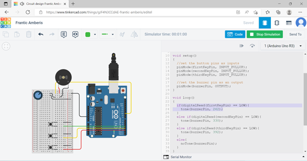

2. Check to see if the second button is pressed.  
a. If it is, play the frequency for e.  
b. If it isn’t, skip to the next **else if** statement.  
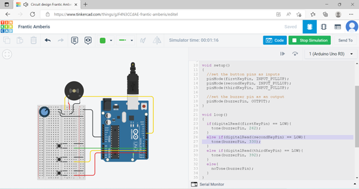

3. Check to see if the third button is pressed.  
a. If it is, play the frequency for g.  
b. If it isn’t, skip to the next **else if** statement.  
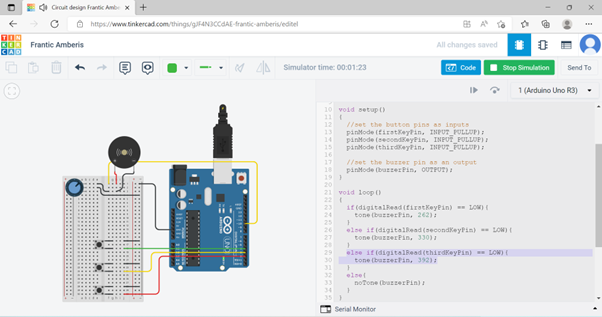

4. If none of the **if** statements are true  
a. Turn the buzzer off.  
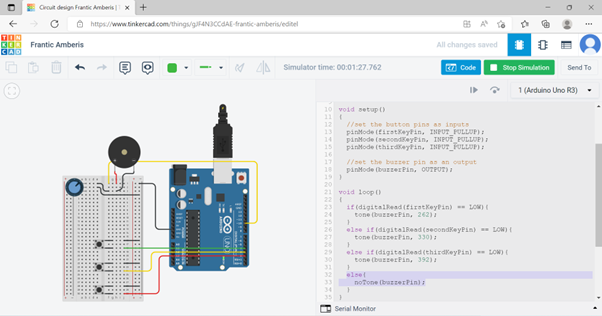

5. Picture of my design:  
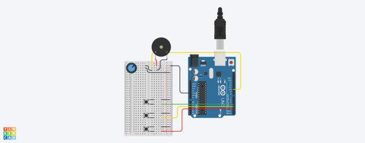

## LEDRGBCircuit.cpp

This circuit uses an IR Remote to turn the LED RGB Red when the user presses 1, Green when the user presses 2 and Blue when the user presses 3 on the IR Remote.

1. Screenshot of user pressing 1 on the IR Remote and the LED turning red:  

2. Screenshot of user pressing 2 on the IR Remote and the LED turning green:  
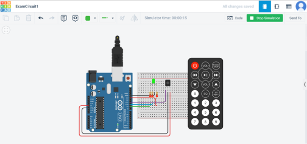

3. Screenshot of user pressing 3 on the IR Remote and the LED turning blue:  

4. Picture of my design:  
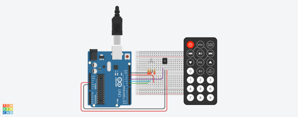

## MelodyCircuit.cpp
The circuit should flash all of the LEDs and play a melody. After a few seconds, it will flash the first light in the pattern. If you repeat the pattern correctly by pressing the corresponding colored button, then the game will move to the next round and add another color to the pattern sequence. If you make a mistake, the “Game Over” melody will play. If you get to round 10, the “You Win” melody will play. Press any button to start a new game.

1. Screenshot of gameplay:  
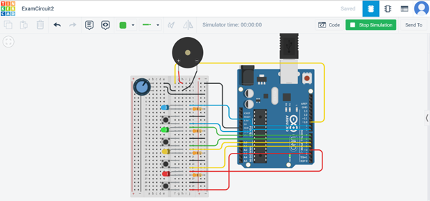

2. Picture of my design:  
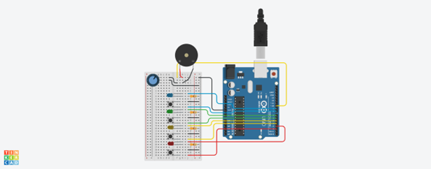

## PasswordLCDCircuit.cpp
The circuit should allow the user to enter a password (Hidden), if its correct the LCD displays CORRECT and the LED turns Green. If its incorrect the LCD displays WRONG and the LED turns Red.

1. Screenshot of first run:  
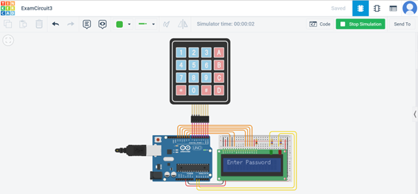

2. Screenshot of user entering correct password and LED turning green:  
a.     
b.   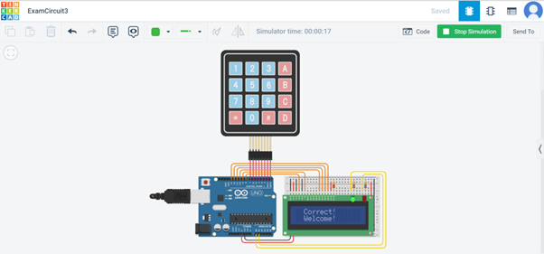

3. Screenshot of user entering incorrect password and LED turning red:  
a.   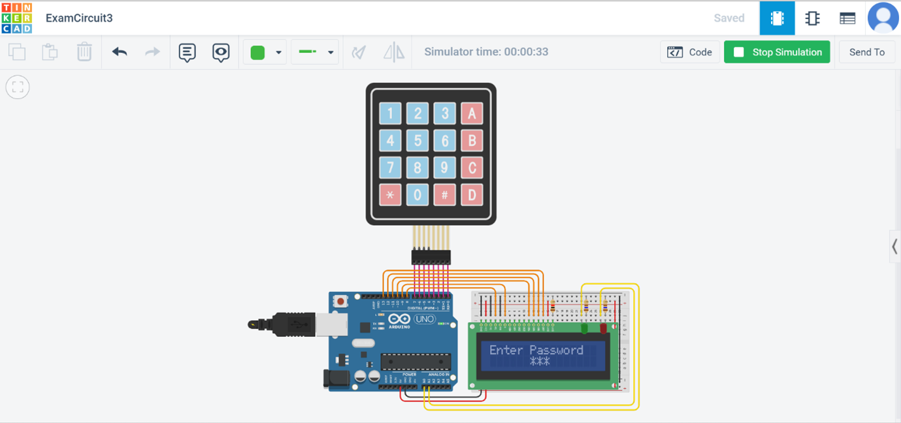  
b.   

4. Picture of my design:  
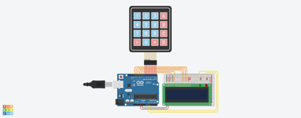
