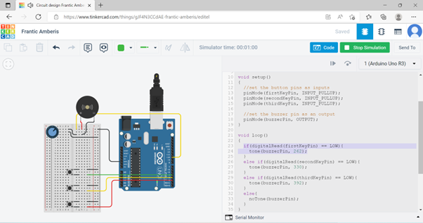
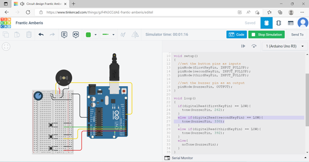
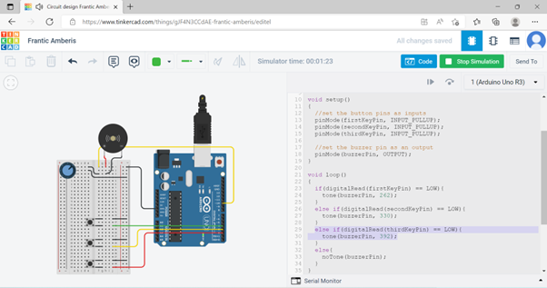
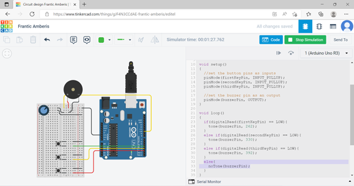

# Robotics
The repository showcases a few small projects that I've worked on, about Circuits (Arduino)

## Context

## Table of Contents

## DigitalTrumpet.cpp 

Use an Arduino IDE to create a digital trumpet the program should do the following (screenshots provided): 

### Code to Note:
| Code                                 | Description                                                                                                                                                                                                                                                      |
|--------------------------------------|------------------------------------------------------------------------------------------------------------------------------------------------------------------------------------------------------------------------------------------------------------------|
| **Internal Pull-Up Resistor:** `pinMode(firstKeyPin, INPUT_PULLUP);` | To declare a standard input, use the line `pinMode(pin_name, INPUT)`. If you would like to use one of the RedBoard's built-in pull-up 20kΩ resistors, it would look like this: `pinMode(firstKeyPin, INPUT_PULLUP);`. The advantage of external pull-ups is being able to choose a more exact value for the resistor. |
| **Digital Input:** `digitalRead(pin);` | Check to see if an input pin is reading HIGH (5V) or LOW (0V). Returns TRUE (1) or FALSE (0) depending on the reading.                                                                                                                                             |
| **Is Equal to:** `if(digitalRead(firstKeyPin) == LOW)` | This is another logical operator. The 'is equal to' symbol (`==`) can be confusing. Two equals signs are equivalent to asking, "Are these two values equal to one another?" On the other hand, one equals sign in code is assigning a particular variable to a value. Don't forget to add the second equals sign if you are comparing two values. |

### Program Overview: 
1. Check to see if the first button is pressed.  
a. If it is, play the frequency for c.  
b. If it isn’t, skip to the next **else if** statement.  

2. Check to see if the second button is pressed.  
a. If it is, play the frequency for e.  
b. If it isn’t, skip to the next **else if** statement.  

3. Check to see if the third button is pressed.  
a. If it is, play the frequency for g.  
b. If it isn’t, skip to the next **else if** statement.  

4. If none of the **if** statements are true  
a. Turn the buzzer off.  

5. Picture of my design:  
